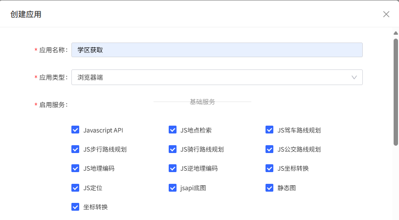
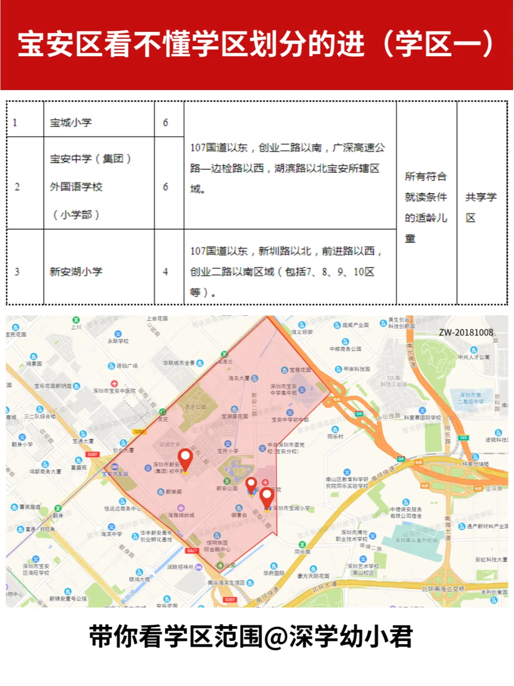

# 学区多边形导出与小区检索工具
本工具基于百度地图API，可在网页上绘制学区范围（多边形），导出该区域的顶点坐标（JSON格式），并使用Python程序进行数据处理，判断有哪些小区位于该学校的学区中

---

## 功能简介

- 在地图上自由绘制多边形，表示学区范围
- 输入学区名称，导出包含学区名称和多边形顶点的JSON数据
- 根据json记录的polygon数据搜索在其中的小区(school_to_xuequ.py)
---

## 使用方法

1. **准备环境**
     申请百度js服务的ak
     
     复制AK替换：<script type="text/javascript" src="https://api.map.baidu.com/api?你的ak"></script>   
   - 使用 [VS Code](https://code.visualstudio.com/) 并安装 Live Server 插件.不要直接用浏览器打开 HTML 文件（file://），否则地图API可能无法正常加载。

2. **运行项目**
   - 用 Live Server 或其它本地服务器启动项目根目录。即鼠标右键并点击“open with live server”
   - 在浏览器访问 `http://localhost:端口/xiaoqufugai.html`。

3. **操作流程**
   - 输入学区名称。可以用搜索框辅助地点寻找过程
   - 点击“画多边形”按钮，在地图上绘制学区范围。
   - 绘制完成后，页面下方会显示该多边形的顶点坐标（JSON格式），包含学区名称字段。复制JSON数据用于后续处理。

---

## JSON导出格式示例
```json
{
  "school": "学区名称",
  "polygon": [
    {"lng":113.948913,"lat":22.530844},
    {"lng":113.950000,"lat":22.531000}
    // ...更多顶点
  ]
}
```

---

## 注意事项

- 为了能够准确地标注好学区范围，请结合主页的搜索功能定位到关键的地理位置(如关键性的道路和位置信心)。参考学区的描述性信息(即‘https://www.baoan.gov.cn/zxbs/jy/ywjy/xqhf/content/post_12212943.html’)和小红书的图文‘5455573810博主’的博文进行标注，如：


参照以上的内容：
在学区名称的输入框中填写学校的名称(如宝成小学)
点击画多边形绘制尽可能准确(!!)的多边形区域（点击画多边形开始绘制，双击结束绘制，右上角有一些工具帮助绘制过程中的标注）


即在下方‘学区的polygon’文字框中出现该学校学区范围的json文件
将json文件复制保存，命名为'{学校名称}'.json
将生成的json文件作为程序school_to_xuequ.py的输入，请自行修改：
with open('baoan.json', encoding='utf-8') as f:
    data = json.load(f)
中'baoan.json'文件的命名，与‘'{学校名称}'.json’对应
将分配搜索的学校的学区整理为一个excel文档
---

## 依赖

- [百度地图API v2.0](https://lbsyun.baidu.com/)
- pip install pandas shapely openpyxl

---
